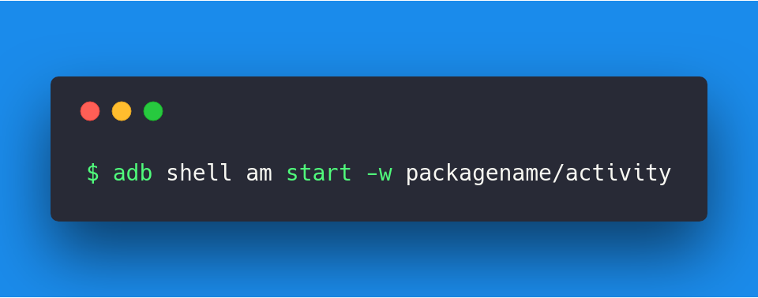
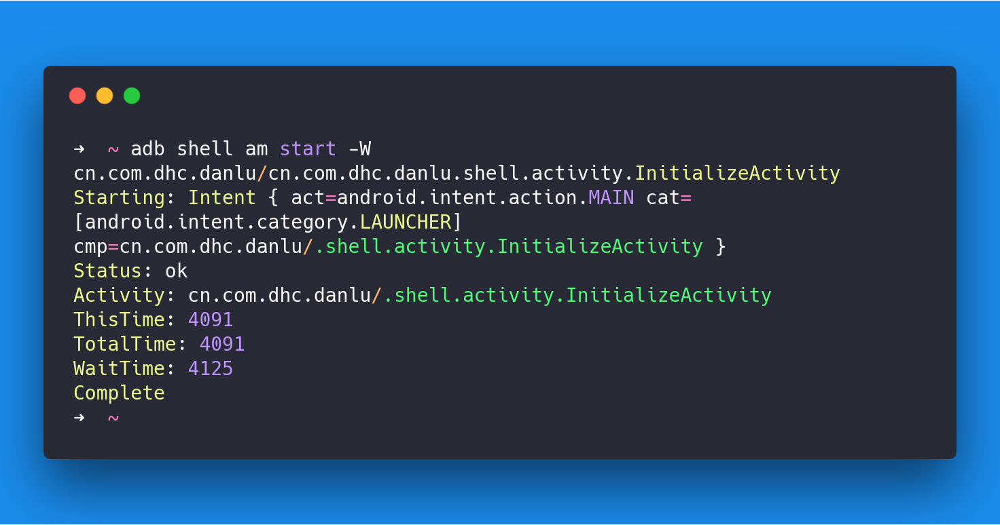
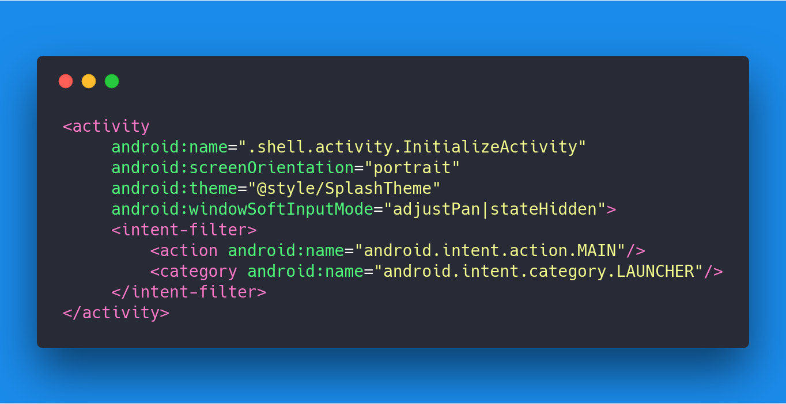
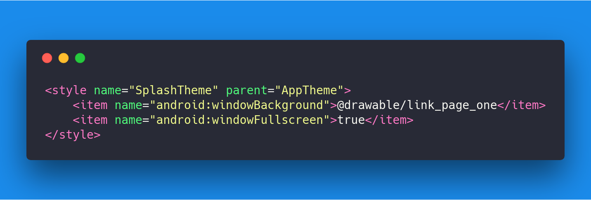
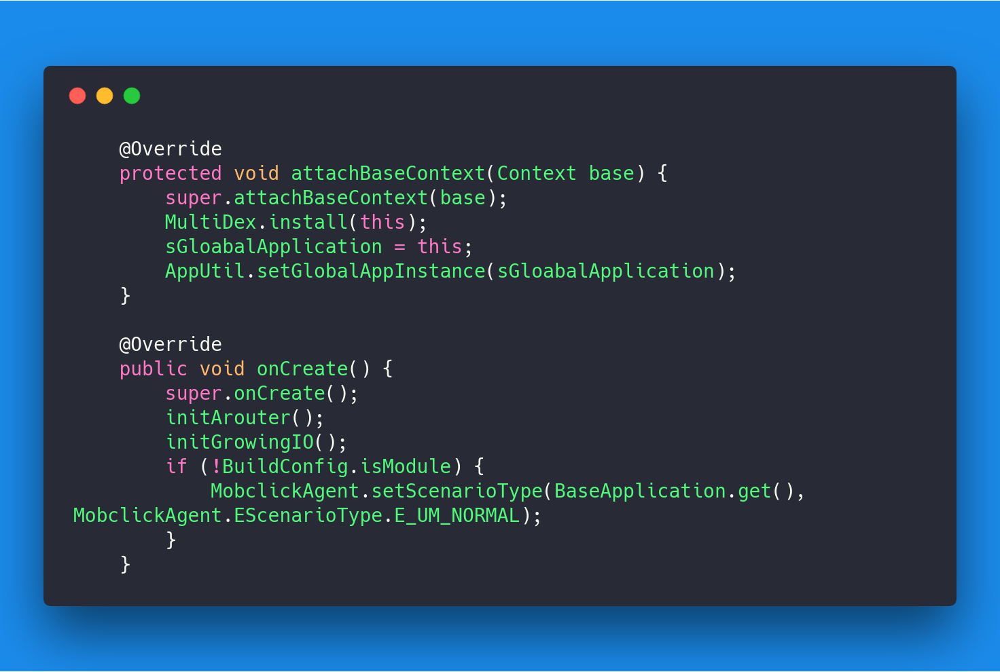
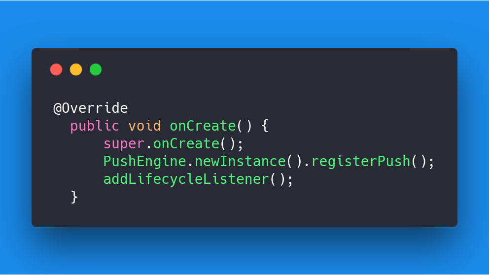
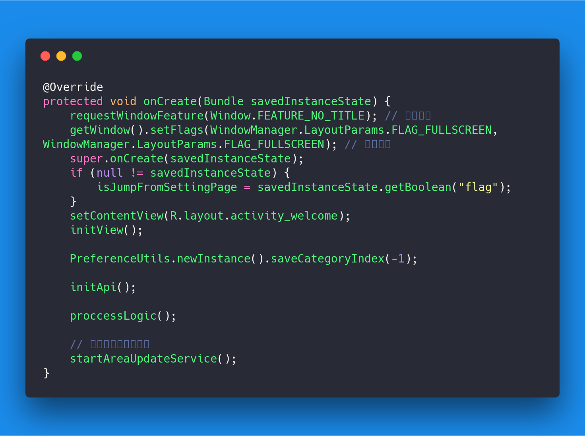
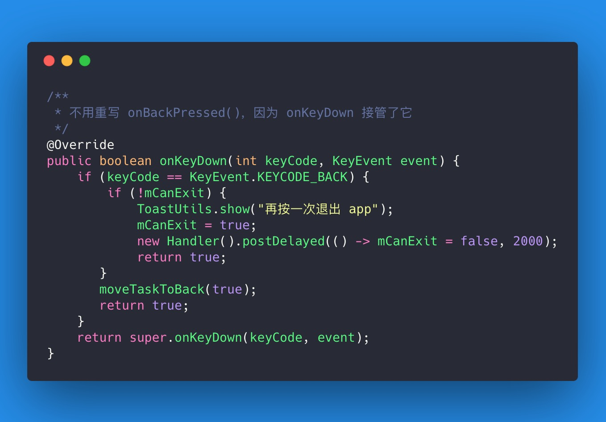
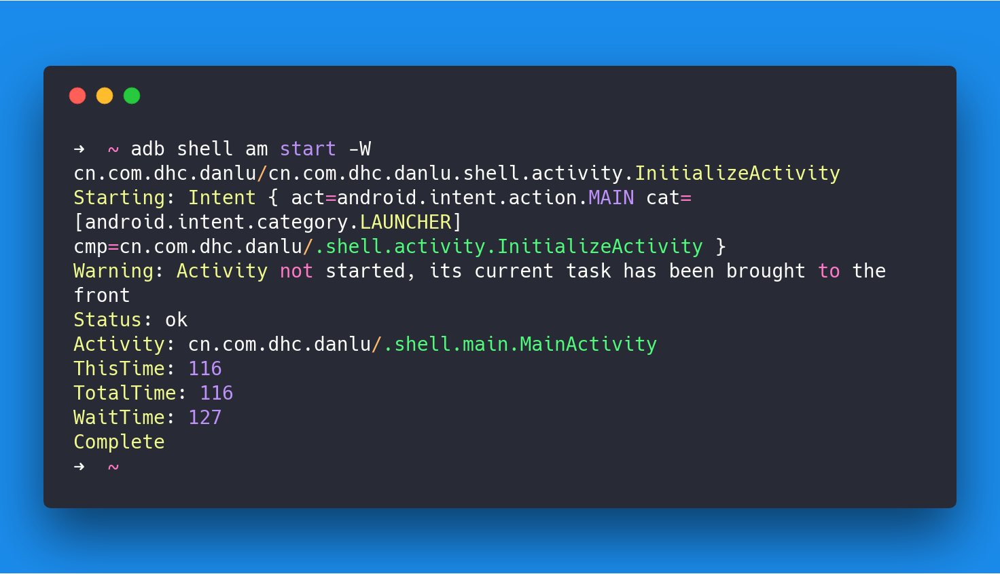

# App 启动优化

## 启动方式

- 冷启动

  当启动应用时，后台没有该应用的进程（常见如：进程被杀、首次启动等），这时系统会重新创建一个新的进程分配给该应用

- 暖启动

  当启动应用时，后台已有该应用的进程（常见如：按`back`键、`home`键，应用虽然会退出，但是该应用的进程是依然会保留在后台，可进入任务列表查看），所以在已有进程的情况下，这种启动会从已有的进程中来启动应用

- 热启动

  相比暖启动，热启动时应用做的工作更少，启动时间更短。热启动产生的场景很多，常见如：用户使用返回键退出应用，然后马上又重新启动应用

热启动和暖启动因为会从已有的进程中来启动，不会再创建和初始化`Application`

**平时我们讨论中基本都会将暖启动和热启动合在一起统称为热启动，因为暖启动与热启动差异很小，如果不是特别留意启动流程，那么在用户体验和感官上没有直接差异，但是在`framework`层执行时是有一定差异的。本次优化点也是围绕冷启动和热启动来做，将暖启动与热启动统称为热启动**

**另外有一点，从绝对时间上来看，`app`安装后的首次启动将会最耗时，因为首次启动会新建数据库，`sp`文件，各种缓存，配置等**

---

## 白屏/黑屏问题

- 白屏或黑屏，具体是哪一个，取决于`app`的`Theme`使用的是`dark`还是`light`主题

- Android Studio 引起的白屏

  `2.x`时代的`AS`开启了`instant run`以后可能会导致白屏，但实际完整的`apk`包不会出现此问题


- 冷启动引起的白屏/黑屏

  点击你`app`那一刻到系统调用`Activity.onCreate()`之间的时间段。在这个时间段内，`WindowManager`会先加载`app`主题样式中的`windowBackground`作为`app`的预览元素，然后再真正去加载`activity`的`layout`布局

- 暖启动/热启动引起的白屏/黑屏

  这点在配置较好，内存空间充足的手机上不是很明显，但低端手机或者内存吃紧的情况下依旧会出现”闪屏”效果，持续时间很短，一闪而过

## 优化

我将冷启动优化分为可控阶段和不可控阶段

- 不可控阶段

  点击`app`以后到初始化`Application`之间这段时间，系统接管，从`Zygote`进程中`fork`创建新进程，`GC`回收等等一系列操作，和我们`app`无关

- 可控阶段

  初始化`Application`开始，如下图

  

  从上图可以看到，整个冷启动流程中至少有两处`onCreate`，分别是`Application`和`Activity`，整个流程都是可控的。所以，`onCreate`方法做的事情越多，冷启动消耗的时间越长

### 启动时间

- Logcat 自动打印

  从`Android 4.4（API 19）`开始，`Logcat`自动帮我们打印出应用的启动时间。这个时间从应用启动（创建进程）开始计算，到完成视图的第一次绘制（即`Activity`内容对用户可见）为止

  - 冷启动 ：

  ```java 
  04-25 14:53:09.317 869-1214/? I/ActivityManager: Displayed cn.com.dhc.danlu/.shell.activity.InitializeActivity: +4s256ms
  04-25 14:53:11.077 869-1214/? I/ActivityManager: Displayed cn.com.dhc.danlu/.shell.main.MainActivity: +559ms
  ```

  - 热启动：

  ```java
  04-25 14:53:20.407 869-1214/? I/ActivityManager: Displayed cn.com.dhc.danlu/.shell.activity.InitializeActivity: +178ms
  04-25 14:53:22.447 869-1214/? I/ActivityManager: Displayed cn.com.dhc.danlu/.shell.main.MainActivity: +131ms
  ```

  - **这个 log 信息是从`com.android.server.am.ActivityRecord#reportLaunchTimeLocked(long curTime)`中打印出来的**：

  ```java
  private void reportLaunchTimeLocked(final long curTime) {
     final ActivityStack stack = task.stack;
     final long thisTime = curTime - displayStartTime;
     final long totalTime = stack.mLaunchStartTime != 0
             ? (curTime - stack.mLaunchStartTime) : thisTime;
     if (ActivityManagerService.SHOW_ACTIVITY_START_TIME) {
         Trace.asyncTraceEnd(Trace.TRACE_TAG_ACTIVITY_MANAGER, "launching", 0);
         EventLog.writeEvent(EventLogTags.AM_ACTIVITY_LAUNCH_TIME,
                 userId, System.identityHashCode(this), shortComponentName,
                 thisTime, totalTime);
         StringBuilder sb = service.mStringBuilder;
         sb.setLength(0);
         sb.append("Displayed ");
         sb.append(shortComponentName);
         sb.append(": ");
         TimeUtils.formatDuration(thisTime, sb);
         if (thisTime != totalTime) {
             sb.append(" (total ");
             TimeUtils.formatDuration(totalTime, sb);
             sb.append(")");
         }
         Log.i(ActivityManagerService.TAG, sb.toString());
     }
     mStackSupervisor.reportActivityLaunchedLocked(false, this, thisTime, totalTime);
     if (totalTime > 0) {
         //service.mUsageStatsService.noteLaunchTime(realActivity, (int)totalTime);
     }
     displayStartTime = 0;
     stack.mLaunchStartTime = 0;
  }

  // normal time：统计的是 Activity 从启动到界面绘制完毕的时间
  // total time ：统计的是 normal time + Activity 栈建立完毕的时间
  ```


- 测量 Activity 启动时间

  `Activity`的`reportFullyDrawn()`

  我们可以在`Activity`的任意位置调用此方法已打印你想看到的、执行完某个方法的最终时间。它会在`Logcat`里打印从`apk`初始化（和前面`Displayed`的时间是一样的）到`reportFullyDrawn()`方法被调用用了多长时间

  ```java
  ActivityManager: Displayed com.Android.myexample/.StartupTiming: +768ms
  ```

  在`4.4`上调用`reportFullyDrawn()`方法会崩溃（但是`log`还是能正常打印），提示需要`UPDATE_DEVICE_STATS`权限 ，但是这个权限无法拿到

  ```java
  try {
  reportFullyDrawn();
  } catch (SecurityException e) {
  }
  ```


- 本地调试启动时间

  

  上述命令可以直接启动对应包名的对应`activity`，但要注意不是全部`activity`都能使用这个命令直接启动

  - 热启动 ：

  

  - 冷启动：

  

  - 只需要关注**TotalTime**即可


 - adb screenrecord 命令

   - 首先启动带`bugreport`选项（它可以在`frames`中添加时间戳－应该是`L`中的特性）的`screenrecord`命令

   

   - 然后点击`app`图标，等待`app`显示，`ctrl-C`停止`screenrecord`命令，在手机存储中会生       成`aunch.mp4`视频文件，然后`pull`到电脑
   - 打开视频逐帧播放，注意视频的上方有一个`frame`时间戳。一直往前直到你发现`app`图标高亮了为止。这个时候系统已经处理了图标上的点击事件，开始启动`app`了，记录下这一帧的时间。继续播放帧直到你看到了`app`整个`UI`的第一帧为止。根据不同情况（是否有启动窗口，是否有启动画面等等）。事件和窗口发生的实际顺序可能会有不同。对于一个简单的`app`来说，你会首先见到启动窗口，然后渐变出`app`真实的`UI`。在你看到`UI`上的任何内容之后，再记录下第一帧，这时`app`完成了布局和绘制，准备开始显示出来了。同时也记录下这一帧所发生的时间
   - 现在把这两个时间相减 `((UI displayed) - (icon tapped))` 得到`app`从点击到绘制就绪的所有时间。虽然这个时间包含了进程启动之前的时间，但是至少它可以用于跟其他`app`比较

**由此可见，`app`冷启动时间大约为**`4s`**，热启动时间大约为**`132ms`**.**

### 优化方案（仅针对可控区范围）

- 从启动流程分析

  减少两处`onCreate()`中的初始化操作，将部分初始化移动到`IntentService`中进行

- 从用户体验分析

  将`app`首页的按返回键响应修改为响应`Home`键，曲线救国。让用户以为`app`确实退出了，但是实际上是点了`Home`键。如此一来，下次点击`app`图标的时候，直接唤起，不需要进行初始化操作，主要可以避免再次走闪屏页，参考美团，微信，QQ，淘宝等（实现的效果一样，但是实现方式就不得而知了）

  - 微博：启动后点击返回键和`Home`键的操作一样，底部选中`tab`没有做自切换
  - 美团：启动后点击返回键和`Home`键的操作不一样，底部选中`tab`做了自切换
  - QQ：同微博
  - 淘宝：启动后在首页按返回键，会先回到第一个`tab`，然后再退出


### 开始优化

- 利用`Google`官方文档推荐的方式，我们将启动页界面的主题设置为`SplashTheme`。此界面是冷启动后首先加载的界面：

  

  主题内的代码如下：

  

  这个主题相当于丢了一张图片作为背景，也就是红色背景`Logo`和`Slogan`图片，无版本号

  此时我们已经“消除了”白屏/黑屏页，将冷启动的白屏/黑屏单调的纯色背景替换为我们即将展示给用户的	`InitializeActivity`界面的图片，从系统的`Window`到我们自己`App`跳转过程，使用了**全屏**属性，以达到无缝跳转

  **需要说明的是，这一步做了之后，对整体启动时间并没有任何的减少，时间不变，只是说给用户的体验要友好很多，不再显示一个突兀的白屏/黑屏界面**   ------将锅甩给自己`app`，`app`太卡，居然在`InitializeActivity`要等这么久（当然用户不知道的是：系统`window`界面和`InitializeActivity`不是同一个界面）

  **当然也可以采用另一种方式，那就是将上面的主题中的backgroud设置为透明用户点击了图标开始启动的时候，界面上没有任何变化，因为此时系统启动的那个白屏/黑屏界面背景透明的**   ------将锅甩给系统，太卡，点了图标居然隔了这么久才显示`InitializeActivity`

- 接下来我们查看`Application`和`InitializeActivity`的`onCreate()`是否有可以迁移到`IntentService`中的代码：

  - BaseApplication：

  

  ​	可以看到，其实当中的逻辑不是很多，并且都是需要在`Application`中初始化完毕的，不能单独提出来进行初始化，其中只有`GrowingIO`可以考虑提出来

  - MainApplication：

  

  ​	推送初始化可以提出来

  - InitializeActivity：

  

  ​	onCreate 中乍看没有什么耗时操作，内部的几个方法也都是必须要的业务逻辑，唯一能动的就是内部针对界面停留做的延时时间，目前是**2s**，可以减少到**1s**左右。

- 最后一步，在`MainActivity`中处理返回键逻辑。

  将确实是退出的逻辑替换为按`Home`键：

  

  这种做法给用户一个假象：用户按返回键退出，但是实际上并没退出，`app`处于后台，下次点击图标时直接唤起

  针对这种操作，需要注意几个点

  - 在`onRestart`中需要判断`tab`状态
  - 在`onSaveInstanceState`和`onRestoreInstanceState`中需要保存和恢复数据，用于判断用户是点了 `home`还是`back`，这两种操作需要区分开，同时需要保存`tab`状态
  - 通过广播监听`Home`键事件
  - ......

- 结果

  冷启动：

  

  热启动：

  

  **由上图可知，优化后的冷启动时间大约为`3544ms`，热启动时间大约为`127ms`，相比之前的`4121ms`以及`151ms`来说有一定的提升，白屏效果也被消除了。**

  **但是其实提升最大的点不是白屏优化，因为我们没有把`Application`和`Activity`中`onCreate`的逻辑减少并提到`IntentService`中。**

  **最大的提升点是，我们让用户退出`app`时，造成假象，让用户以为他确实退出了`app`，但实际上我们是藏在后台，当用户热启动或者温启动时，我们不用再经过`InitializeActivity`的流程进入首页。**

---

## 总结

- 白屏/黑屏界面使用图片替换
- `onCreate`中尽量避免做过多的初始化动作，如果必须，那么考虑`IntentService`
- 首页中对`Back`和`Home`键的动作做一些假象，使用户按`Back`键时以为他退出了，以减少下次启动的不必要动作（**建议：非即时消息类和社交类`app`，这种做法慎用，因为可能有流氓之嫌。。。（逃）**）
- `Activity#moveTaskToBack(true)`

---

## 参考资料

- [What does “I/ActivityManager: Displayed…activity…+850ms” comprised of?](https://stackoverflow.com/questions/32844566/what-does-i-activitymanager-displayed-activity-850ms-comprised-of)

- [Launch-time performance](https://developer.android.com/topic/performance/launch-time#profiling)

- [Android 开发之 App 启动时间统计](https://www.jianshu.com/p/c967653a9468)

- [android 性能优化 -- 启动过程 冷启动 热启动](http://www.cnblogs.com/xunzhi/p/5794793.html)

- [Android 你应该知道的应用冷启动过程分析和优化方案](https://yifeng.studio/2016/11/15/android-optimize-for-cold-start/)


---

## TODO

- [ ] 探究：为何新建的 Hello World 工程冷启动白屏时间比线上工程短一些

## LICENCE
NONE
